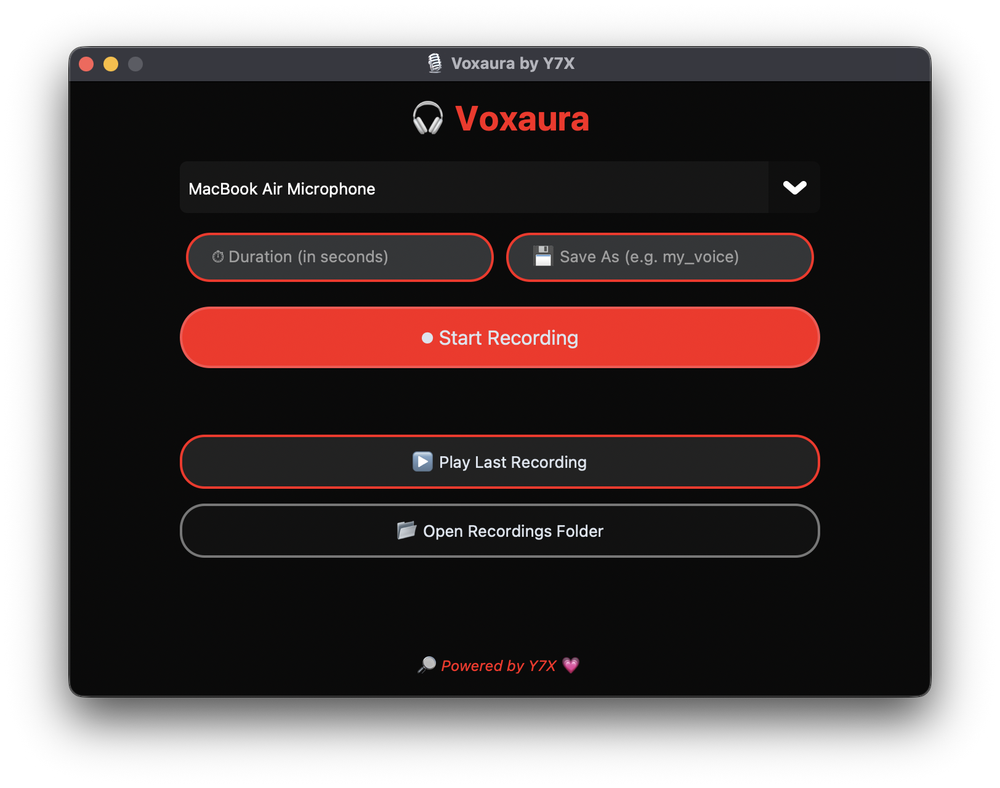

<h1 align="center">🎙️ Voxaura</h1>
<p align="center">
  <b>Voice recording made smooth, clean, and yours.</b><br>
  <i>🔎 Powered by Y7X 💗</i>
</p>

<p align="center">
  
</p>

---

### 🎧 Features

- ⏺️ Record audio from any input device
- 💾 Save with custom file names
- 🧠 Organized layout with grouped pill-shaped fields
- 🎵 Play your last recording instantly
- 📂 Quick access to the recordings folder
- 🎛️ Device selector for multi-mic setups
- 🔴 AMOLED-style dark UI with red glow highlights

---

### 🚀 Getting Started

```bash
git clone https://github.com/Y7X-bit/voxaura.git
cd voxaura
pip install -r requirements.txt
python voxaura.py